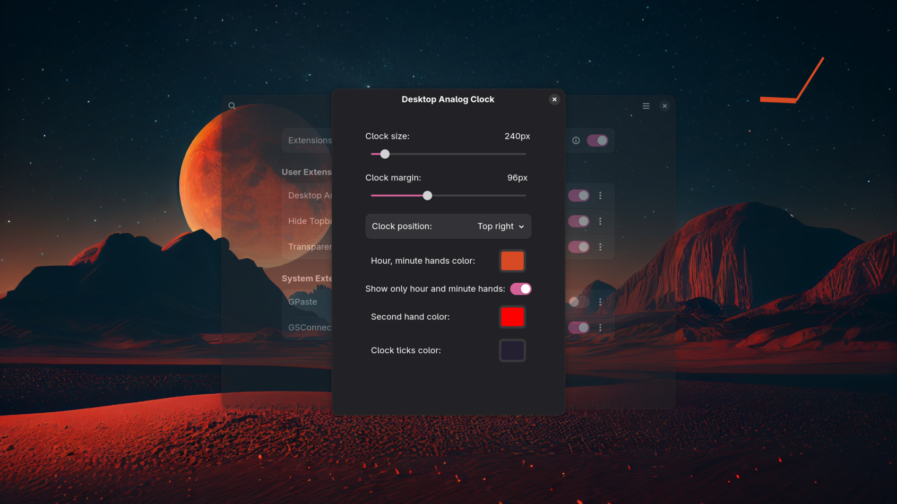

2025October31



# GNOME Analog Clock

### Intro

Customizable analog clock to show on desktop. Compatible with GNOME 45+

### Installation

The easiest way to install this extension is via the [GNOME Shell Extensions](https://extensions.gnome.org/) website.

### Manual Installation

For manual installation, you need to have **git** and **glib** installed on your system.

```bash

git clone https://github.com/sonersg/gnome-analog-clock

mv gnome-analog-clock gnome-analog-clock@sonersg.com

mv gnome-analog-clock@sonersg.com ~/.local/share/gnome-shell/extensions/

glib-compile-schemas ~/.local/share/gnome-shell/extensions/gnome-analog-clock@sonersg.com/schemas

gnome-extensions enable gnome-analog-clock@sonersg.com

```

⚠️ **You may have to log out and in!**

#### To Compile Schema with NIX Package Manager

```bash
nix-shell -p glib --run "glib-compile-schemas ~/.local/share/gnome-shell/extensions/gnome-analog-clock@sonersg.com/schemas"
```
